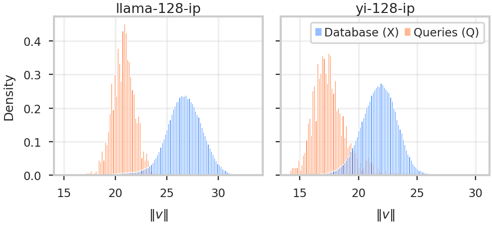
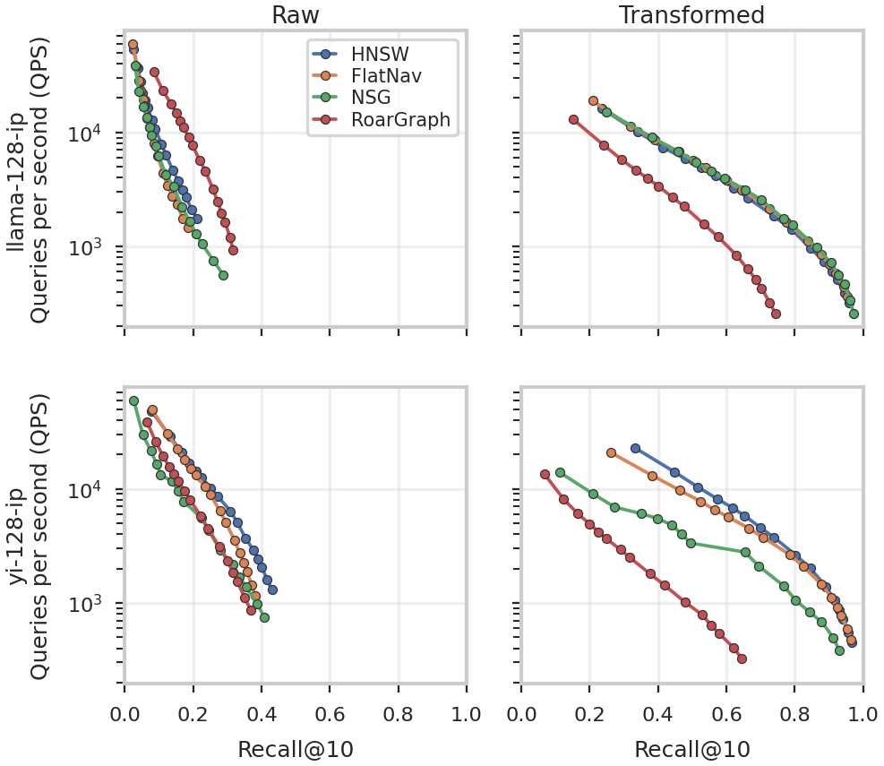

# Recovering Graph ANN Search on Attention-Derived Workloads via a Query-Agnostic Spherical Transformation

[](https://github.com/Coda-Research-Group/RecoverGraphANN/actions/workflows/ci.yml)
[](https://doi.org/10.1145/3799682.3839984)
[](LICENSE)
[](environment.yml)

**HNSW recovers from 21% to 96% recall@10 on attention-derived workloads with one preprocessing step and no index changes.**

Graph indexes collapse on attention-derived inner-product data.
[HNSW](https://github.com/nmslib/hnswlib), [NSG](https://github.com/facebookresearch/faiss) and
[FlatNav](https://github.com/BlaiseMuhirwa/flatnav) all stay below 50% recall@10 on
[VIBE](https://github.com/vector-index-bench/vibe)'s `yi-128-ip` and `llama-128-ip`, across
every graph degree we tried.

The cause is at build time, not search time. HNSW's neighbor-selection heuristic accepts barely
**one** candidate out of an `efConstruction = 500` pool, because the first neighbour it picks is
the highest-norm one and that vector's norm then makes almost every remaining candidate look
closer to *it* than to the point being inserted. The graph that comes out is too sparse for
greedy descent.



Figure 1, regenerated by `make figures`. Database and query vectors sit in different norm
ranges — mean 26.6 against 20.8 on `llama-128-ip`, 21.8 against 17.6 on `yi-128-ip`
([`figures/norm_distribution_stats.csv`](figures/norm_distribution_stats.csv)) — which is what
makes these workloads out-of-distribution, and the spread within the database norms is what the
heuristic reacts to.

The fix is one preprocessing step on the database: scale it by its largest row norm and lift it
onto the unit sphere in `d+1`. It is
[Bachrach et al.'s 2014 transformation](https://doi.org/10.1145/2645710.2645741), and it reads
only the database, never the queries. At the paper's `M = 48` it takes acceptance from 1.5
candidates to 13.4 on `yi-128-ip` and from 1.1 to 22.0 on `llama-128-ip` — 8.8x and 19.6x —
and recall above 95%.

This repository is the reproducibility artifact for:

> David Procházka, Vlastislav Dohnal, and Martin Aumüller. 2026.
> **Recovering Graph ANN Search on Attention-Derived Workloads via a Query-Agnostic Spherical Transformation.**
> In *Proceedings of the 35th ACM International Conference on Information and Knowledge Management (CIKM '26)*, November 7–11, 2026, Rome, Italy. ACM.
> [doi:10.1145/3799682.3839984](https://doi.org/10.1145/3799682.3839984)

---

## Start here

| If you want to | Then | Takes |
|---|---|---|
| see what the paper claims | [Results at a glance](#results-at-a-glance) | — |
| regenerate a table or figure from committed data | `make table`, `make figures` | seconds |
| check that the code runs on your machine | `make quick` | ~5 min |
| reproduce every number from scratch | `make all` | ~3.5 h |
| count how often HNSW's heuristic prunes, in your own project | [`docs/PATCHES.md`](docs/PATCHES.md) | — |
| know exactly which script made which number | [What produces what](#what-produces-what) | — |

## Results at a glance

Recall@10 at the paper's settings — `M = 48`, `efConstruction = 500`, `efSearch = 1000`, k = 10,
single-threaded. `acc` is the average number of candidates the neighbor-selection heuristic
accepts per insertion, out of a pool of 500; `deg` is the average node degree.

| Dataset | | `acc` | `deg` | Recall@10 |
|---|---|---:|---:|---:|
| `yi-128-ip` | raw | 1.5 | 2.2 | 43.0% |
| | **transformed** | **13.4** | **27.1** | **96.7%** |
| `llama-128-ip` | raw | 1.1 | 1.4 | 21.1% |
| | **transformed** | **22.0** | **42.6** | **95.8%** |

The heuristic accepts one candidate in the raw space and twenty in the transformed one. That is
the whole mechanism: nothing about the search changes, only the geometry the graph is built in.



Figure 3, regenerated by `make figures`. Left column raw, right transformed; the x-axis is
recall, so further right is better. HNSW, NSG and FlatNav move from a wall around 40% to the
93%-97% band. RoarGraph is query-*aware* by design and appears here without the query sample
it was built for, which is the point of including it: everything in this artifact is
query-agnostic, and the index may see only the database.

Full table, including `M ∈ {4, 16, 48, 96}`: [`results/table1_degree.csv`](results). Every cell
of it is checked against the run logs by `tests/test_paper_numbers_trace.py`.

## What produces what

Every entry point is named after the paper artifact it produces. Nothing here requires you to
edit source to select an experiment.

| Paper artifact | Command | Reads | Writes |
|---|---|---|---|
| Table 1 (`acc`, `deg`, Recall@10) | `make table` | `results/table1_degree.csv` | `results/table1_degree.tex` |
| Figure 1 — norm distributions | `make figures` | `data/*.hdf5` | `figures/norm_distribution_panels.pdf` |
| Figure 2 — pairwise inner products | `make figures` | `data/*.hdf5` | `figures/inner_product_distribution_panels_raw.pdf` |
| Figure 3 — recall vs QPS | `make figures` | `results/fig3_recall_qps.csv` | `figures/efsearch_recall_qps_2x2.pdf` |
| §6 L2-normalization ablation | `make ablation` | `data/*.hdf5` | `results/ablation_l2_normalization.csv` |

The CSVs behind them are committed, so **figures and Table 1 regenerate in seconds without
building a single index**. Rebuilding the numbers themselves is `make all` — see
[Reproducing from scratch](#reproducing-from-scratch).

Two abbreviations in Table 1 have longer names everywhere in this repository, because a
reader of a CSV should not have to guess:

| Table 1 | in the code and CSVs | easy to misread as |
|---|---|---|
| `acc` | `accepted_candidates_avg` | a ratio — it is a **count**, out of the `efConstruction` pool |
| `deg` | `avg_node_degree` | the level-0 degree — it is summed over **all** layers, roughly 0.4 higher |

Neither is available from stock hnswlib. See [The hnswlib instrumentation](#the-hnswlib-instrumentation).

---

## Verified end to end

`make release-check` reports **Ready to tag**, and every reviewer path below was run end to
end rather than reasoned about:

| path | result |
|---|---|
| `make docker ISA=scalar`, then `make quick` in the image | 192 s build, 324 s run |
| `scripts/setup_ubuntu.sh` on a bare `ubuntu:24.04`, then `make quick` | 263 s setup, 310 s run |
| `scripts/setup_macos.sh` on Apple Silicon, then `make quick` | 62 s download, 102 s run |

All three submodules are wired at pinned commits, `make check-patches` matches them byte for
byte, and all three forks clone anonymously.

Anything here that does not reproduce belongs in the
[issue tracker](https://github.com/Coda-Research-Group/RecoverGraphANN/issues).

---

## Setup

### Docker (recommended)

The `Dockerfile` is Ubuntu 24.04 from scratch, so it doubles as an executable version of the
native instructions below.

```shell
git clone --recurse-submodules https://github.com/Coda-Research-Group/RecoverGraphANN.git
cd RecoverGraphANN
make docker                 # add ISA=scalar on a pre-AVX2 CPU, see the note below
bash scripts/download_data.sh
docker run --rm -v "$PWD/data:/app/data" -v "$PWD/results:/app/results" \
    recovergraphann:latest make quick
```

Build the image on the machine you will run on; do not pull a prebuilt one. FlatNav and
RoarGraph compile against the build host's instruction set.

### Ubuntu 24.04 LTS, from a fresh install

Assumes nothing but a working `git` and `sudo`.

```shell
sudo apt-get update
sudo apt-get install -y git

git clone --recurse-submodules https://github.com/Coda-Research-Group/RecoverGraphANN.git
cd RecoverGraphANN

bash scripts/setup_ubuntu.sh      # apt packages, Miniforge, conda env, all three backends
                                  # measured: 263 s on the machine in the hardware note

# Miniforge installs in batch mode and does not edit your shell config, so conda is not on
# PATH yet. The setup script prints this line for you; it lasts for the current shell.
export PATH="$HOME/miniforge3/bin:$PATH"

bash scripts/download_data.sh     # ~635 MB, checksum-verified

conda activate rgann
make quick
```

`scripts/setup_ubuntu.sh` ends by importing every backend and printing its version, so you
know immediately whether the build worked. In particular it checks that `hnswlib` is the
instrumented build — the stock package imports fine but silently cannot produce Table 1.

### macOS

```shell
brew install --cask miniforge
bash scripts/setup_macos.sh
bash scripts/download_data.sh     # measured: 62 s
make quick                        # measured: 102 s, RoarGraph skipped
```

`make quick` skips any backend this platform cannot install and says so. A canonical
`make all` refuses instead — a Figure 3 quietly missing a curve would be worse than a
failure.

### Platform support

Both rows below were run end to end while preparing this artifact; "yes" means measured, not
expected.

| | HNSW (hnswlib) | NSG (FAISS) | FlatNav | RoarGraph | Figures & Table 1 |
|---|---|---|---|---|---|
| Linux x86-64 | yes | yes | yes | yes | yes |
| macOS, Apple Silicon | yes | yes | yes¹ | **no**² | yes |

Everything the paper's *method* claims runs on both. Only Figure 3's RoarGraph baseline curves
need Linux x86-64, and that is the configuration the published numbers come from.

Other platforms — Intel Macs, Linux arm64 — are simply absent from the table because nobody
has run them. That is not a claim they fail.

¹ FlatNav needs `patches/flatnav-macos-arch.patch`, applied automatically on macOS by
`scripts/install_flatnav.sh`. Upstream's `setup.py` hard-codes `-arch x86_64` — true of every
Mac when `v0.1.2-rc1` was tagged — which on Apple Silicon contradicts scikit-build's
`CMAKE_OSX_ARCHITECTURES=arm64`, and CMake refuses to configure. The patch builds for
`platform.machine()` instead.

² RoarGraph's distance kernels are written directly against x86 SIMD intrinsics
(`third_party/RoarGraph/include/efanna2e/distance.h`), so the hard requirement is x86-64 — AVX
suffices, and the paper's own machine has no AVX2. Apple Silicon cannot satisfy it.
`scripts/setup_macos.sh` skips RoarGraph on all of macOS, including Intel Macs, which do
satisfy it: no Intel Mac was available to check, and an unrun build step is worse than a
documented gap.

### The indexes, and where they come from

| | Upstream | Used for |
|---|---|---|
| HNSW | [nmslib/hnswlib](https://github.com/nmslib/hnswlib) | the paper's primary index, and the only one instrumented |
| NSG | `IndexNSGFlat` in [FAISS](https://github.com/facebookresearch/faiss) | a second query-agnostic graph baseline |
| FlatNav | [BlaiseMuhirwa/flatnav](https://github.com/BlaiseMuhirwa/flatnav) | a single-layer graph baseline |
| RoarGraph | [matchyc/RoarGraph](https://github.com/matchyc/RoarGraph) | the query-*aware* comparator, adapted to this setting |

FAISS also supplies the exact brute-force ground truth and the database-side k-NN tables.
[`docs/PATCHES.md`](docs/PATCHES.md) says exactly what was changed in each, and what was not.

### Check it works

Before committing a machine to the full run, confirm the pipeline end to end on a 10 000-row
subsample — all four backends, every stage. **Measured at 324 s** in the Docker image on the
Xeon E5-2620 described below, which is the slowest hardware this is expected to meet, so read
it as an upper bound:

```shell
make quick          # or: make docker-quick, which builds the image and runs it inside
```

Its numbers are **not** the paper's; a 10k subsample has different geometry. It tells you the
software works, nothing more, which is why it writes to `results/quick/` and `figures/quick/`
rather than over the committed results. Both are gitignored, and `make clean` removes them.

### If it does not work

| Symptom | Cause |
|---|---|
| `make table` reports missing `accepted_candidates_avg` | stock hnswlib is installed, not the instrumented fork. It imports fine and silently cannot produce Table 1 — `scripts/setup_ubuntu.sh` checks for this at the end |
| `SIGILL` / "Illegal instruction" from FlatNav | built with AVX2+FMA on a CPU without them; rerun `scripts/install_flatnav.sh`, which detects this from `/proc/cpuinfo`, or build with `ISA=scalar` |
| `ImportError: RoarGraph` | expected off Linux x86-64 — see the platform table above; everything else still runs |
| `tsl/robin_map.h: No such file` | cloned without `--recurse-submodules`; RoarGraph has submodules of its own |
| checksum mismatch from `download_data.sh` | a partial download; delete `data/*.hdf5` and rerun it |

---

## Reproducing from scratch

```shell
make all      # writes results/*.csv and results/timings.csv
```

One script, `scripts/run_all_experiments.sh`, runs every timed experiment and appends to a
single `results/timings.csv`, so a reviewer's timings live in one place and can be compared to
ours in one diff. It is resumable: finished artifacts are skipped, so an interrupted run
continues where it stopped.

Budget **about 3.5 hours** wall clock, single-threaded. That is not an estimate: it is the sum
of the committed [`results/timings.csv`](results/timings.csv), which the run writes itself, one
row per stage.

| Stage | Wall clock |
|---|---:|
| Figure 3 — recall/QPS sweeps, four indexes × two datasets × two spaces | 2.02 h |
| Table 1 — `M ∈ {4, 16, 48, 96}`, both spaces | 1.05 h |
| §6 L2-normalization ablation | 0.47 h |
| Figures 1 and 2 | &lt; 1 min |

Your own run appends to the same file, so comparing your timings to the reference machine's is
a diff rather than an exercise.

If you only want to check the *figures* against the committed data, `make figures` and
`make table` need no build at all.

### Recall reproduces. Throughput does not.

Every QPS number in the paper was measured on:

- **Intel Xeon E5-2620 @ 2.00 GHz** (Sandy Bridge, 6 cores / 12 threads), 157 GB RAM, Debian 12
- single-threaded build **and** search (`--threads 1`, the default)
- **no AVX2** — so FlatNav is built with `patches/flatnav-scalar-build.patch`, which
  `scripts/install_flatnav.sh` applies automatically when it does not find `avx2` and `fma`
  in `/proc/cpuinfo`

On any modern CPU you should expect substantially higher QPS at the same recall. Recall,
`acc` and `deg` are hardware-independent and should match ours.

### What is deterministic

HNSW's layer assignment is randomised and its graph depends on insertion order, so `acc` and
`deg` — the whole substance of Table 1 — do not reproduce unless both are fixed. They are:

- every index seed is pinned and written into the results CSV (`build_seed` column)
- insertion order is the HDF5 row order and is never shuffled; the normalizations are
  row-wise and `apply_normalization` refuses to return a different number of rows than it
  was given, with `tests/test_transform.py` asserting row i stays row i in every mode
- the database-side k-NN sampling for RoarGraph uses `--learn-seed` (42 in the paper)
- `--quick` takes a *prefix* rather than a random sample, precisely so subsample insertion
  order is a prefix of the full-run order

Wall-clock timings are not deterministic and are reported as measured.

Each results row also records where it came from: timestamp, git commit and whether the tree
was dirty, CPU model, platform, Python version, and a `hostname`. That last one defaults to
the machine's own name, which is what you want for your own runs. Set `RGANN_HOSTNAME` to
publish under a label instead — the results committed here read `reference-machine`, because
the real name identifies infrastructure that is not ours to expose and a public repository is
not something you can take back. The CPU model, in its own column, is the part that actually
explains a throughput number.

---

## The hnswlib instrumentation

Table 1's `acc` column is not exposed by any of the libraries this artifact builds on — stock hnswlib, FAISS and FlatNav all report neighbour counts but not how many candidates the selection heuristic accepted. Producing it required
instrumenting hnswlib's neighbor-selection loop to count how many candidates
`getNeighborsByHeuristic2` actually accepts. That patch is the most reusable thing in this
repository and the least likely to be reconstructable from the paper, so it is shipped three
ways:

1. As a pinned submodule — `third_party/hnswlib`, at a named commit on the
   `RecoverGraphANN` branch of [Coda-Research-Group/hnswlib](https://github.com/Coda-Research-Group/hnswlib).
2. As a standalone diff against a named upstream commit —
   `patches/hnswlib-*.patch`, generated against `nmslib/hnswlib@3f342966` (release v0.8.0).
3. Documented hunk by hunk in [`docs/PATCHES.md`](docs/PATCHES.md).

What it adds:

| Addition | Why |
|---|---|
| `AddPointMetrics` returned from `add_items` | per-insertion `(candidate pool size, accepted count)` pairs — Table 1's `acc` |
| `Index.get_all_links()` | per-level neighbour lists — Table 1's `deg` |
| `enable_pruning` flag on `addPoint` / `add_items` | switches the heuristic off, to confirm the sparsity is caused by pruning and not by anything else |

`make check-patches` regenerates each patch from the pinned submodule commit and fails if it
differs by a byte, so the submodule and the diff cannot drift apart.

The same applies to RoarGraph (`patches/roargraph-*.patch`, against `matchyc/RoarGraph@78bf05cf`).
**FlatNav's source is unmodified**: the pinned commit `a5383a44` is exactly upstream's
`v0.1.2-rc1` tag. Its *build* is patched twice, by `scripts/install_flatnav.sh` at install
time — `flatnav-scalar-build.patch` on CPUs without AVX2+FMA, which includes the paper's own
machine, and `flatnav-macos-arch.patch` on macOS. Both change compiler flags rather than the
algorithm, and neither is covered by `make check-patches`, since they are written against
upstream's `setup.py` rather than being diffs between two commits. It is nonetheless forked
into the organisation, because it is the one backend whose source is not otherwise copied
anywhere in this artifact — see [`third_party/README.md`](third_party/README.md).

---

## Datasets

Two datasets from [VIBE](https://github.com/vector-index-bench/vibe), the vector-index
benchmark these workloads come from, both inner-product with `d = 128`:

| Dataset | n | Queries | Source model |
|---|---|---|---|
| `yi-128-ip` | 187 843 | 1 000 | [Yi-6B-200K](https://huggingface.co/01-ai/Yi-6B-200K) |
| `llama-128-ip` | 256 921 | 1 000 | [Llama-3-8B-Instruct-262k](https://huggingface.co/gradientai/Llama-3-8B-Instruct-262k) |

`scripts/download_data.sh` pins them to
[revision `c8723b8f`](https://huggingface.co/datasets/vector-index-bench/vibe) of the VIBE
dataset repository and verifies SHA-256 against `data/MANIFEST.sha256`. Those checksums were
taken from the copies the experiments actually ran against and re-verified against Hugging
Face on 2026-08-17; they agree, so the files have not drifted since the paper was written.

---

## Repository layout

```
src/rgann/            the library: transform, dataset loading, index backends, metrics
experiments/          one entry point per paper artifact
scripts/              setup, data download, the single timed-experiment runner
results/              committed CSVs — this artifact's own run, plus timings
results/paper/        the hand-assembled CSVs the camera-ready was written from, verbatim
results/logs/         the raw per-run logs Table 1 was originally read out of
figures/              committed PDFs, exactly the three the paper includes
third_party/          pinned submodules (hnswlib, FlatNav, RoarGraph)
patches/              each fork branch as a diff against its named upstream commit
docs/PATCHES.md       what was changed in each fork, hunk by hunk
tests/                unit tests, plus the checks that trace printed numbers to committed data
```

`results/` and `results/paper/` are deliberately separate: one is what this code produces, the
other is what the paper said, and keeping them apart is what makes the comparison checkable
rather than a matter of trust.

## What is checked automatically

CI runs the half of the verification that does not need a compiled backend or a 635 MB
dataset: lint, `shellcheck`, the unit tests, the patch-drift guard, and a test that resolves
**every printed cell of Table 1** back to a row in `results/logs/`. That last one is why the
`acc` and `deg` definitions cannot quietly drift: change what either means and the suite says
so.

The other half — building all four indexes and reproducing the numbers — runs on the
reference machine. A CI runner has different silicon, so its throughput figures would not
mean anything.

---

## Citation

```bibtex
@inproceedings{prochazka2026recovering,
  title     = {Recovering Graph {ANN} Search on Attention-Derived Workloads via a
               Query-Agnostic Spherical Transformation},
  author    = {Proch{\'a}zka, David and Dohnal, Vlastislav and Aum{\"u}ller, Martin},
  booktitle = {Proceedings of the 35th ACM International Conference on Information and
               Knowledge Management (CIKM '26)},
  year      = {2026},
  publisher = {Association for Computing Machinery},
  doi       = {10.1145/3799682.3839984}
}
```


## License

MIT — see [LICENSE](LICENSE). Dependencies are compatibly licensed:
[hnswlib](https://github.com/nmslib/hnswlib) and
[FlatNav](https://github.com/BlaiseMuhirwa/flatnav) are Apache-2.0,
[RoarGraph](https://github.com/matchyc/RoarGraph) and
[FAISS](https://github.com/facebookresearch/faiss) are MIT, and
[VIBE](https://github.com/vector-index-bench/vibe) is MIT.

## Acknowledgements

Supported by Czech Science Foundation project No. GF23-07040K. Computational resources were
provided by the e-INFRA CZ project (ID:90254) and the ELIXIR-CZ project (ID:90255), supported
by the Ministry of Education, Youth and Sports of the Czech Republic.
